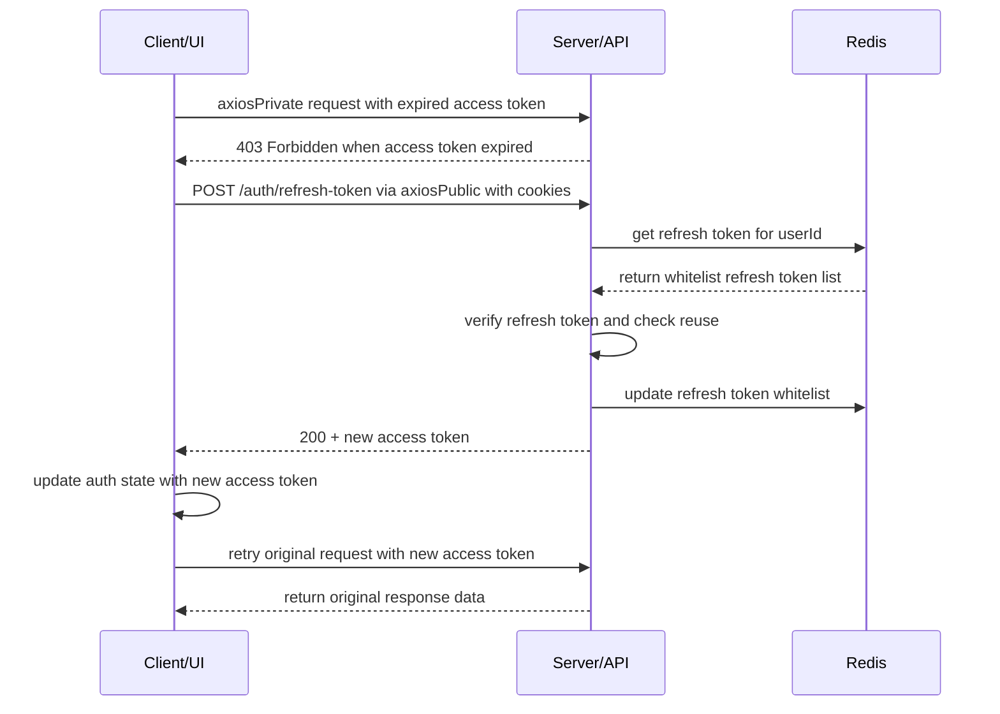
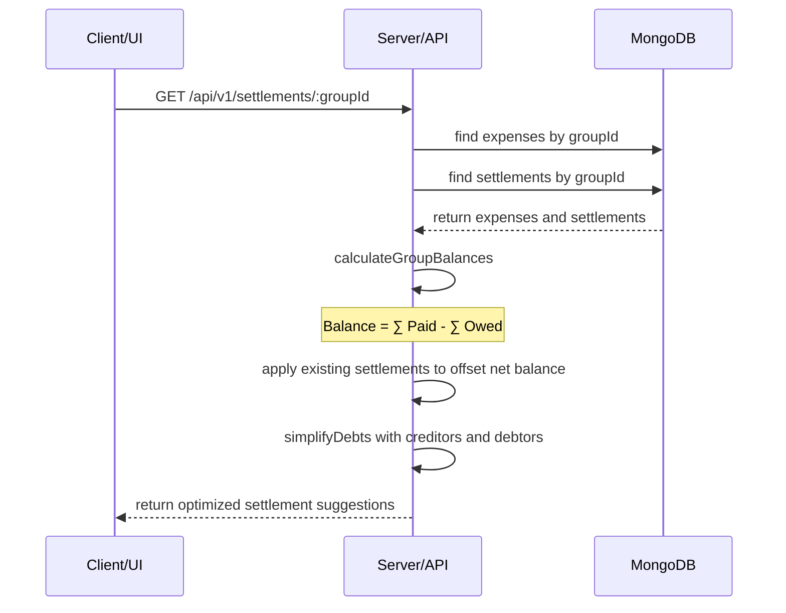
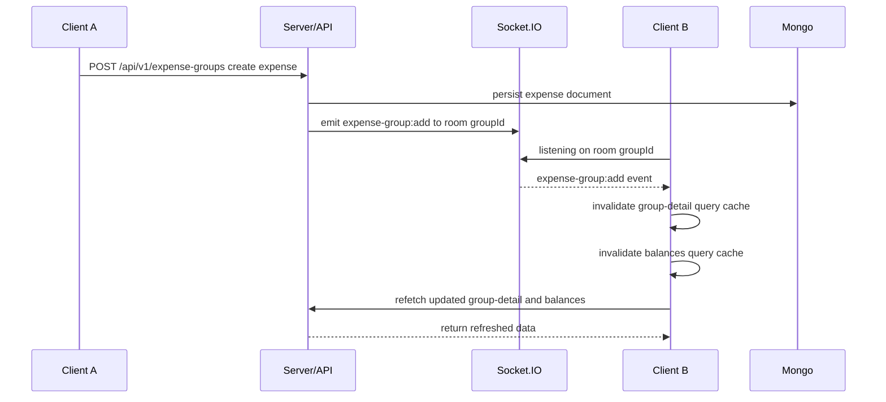
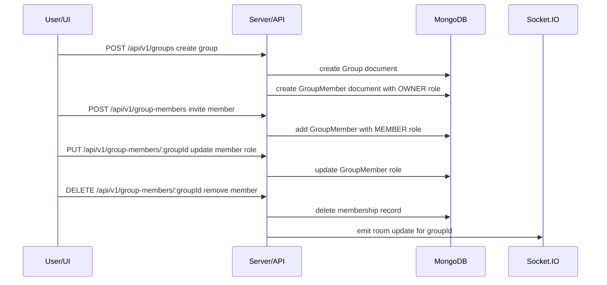
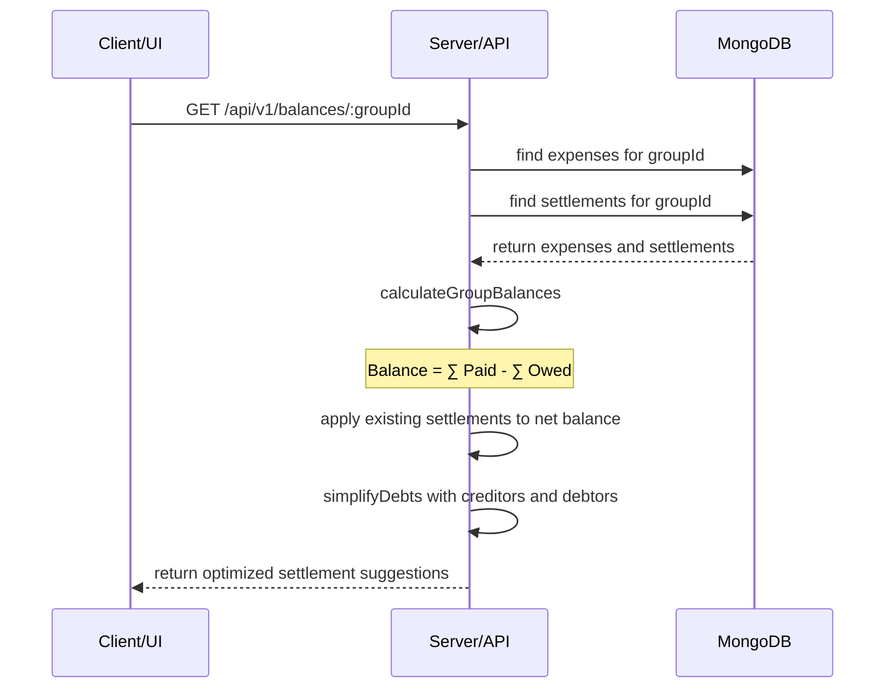
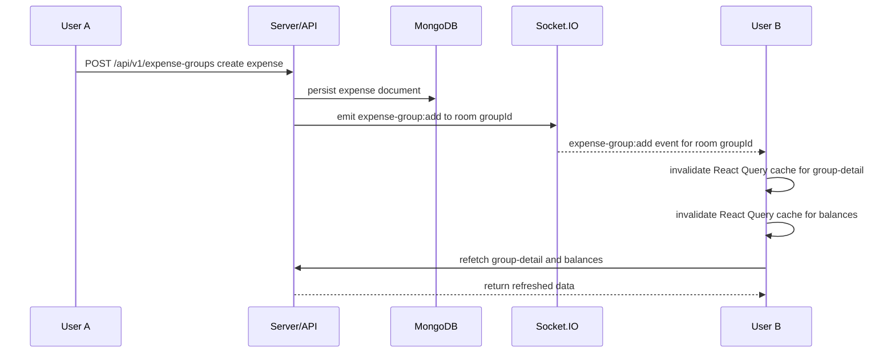

# Personal Finance Expense Tracker

## 📌 Project Description

Personal Finance Expense Tracker is an expense management application for both personal and group use. The project includes:

- Backend (`/backend`): API server built with Node.js + TypeScript using Express, MongoDB, and Redis.
- Frontend (`/frontend`): Web client built with React + TypeScript using Vite, Tailwind CSS, and Ant Design.

The application allows users to register/login, create shared expense groups, manage categories, record expenses, calculate group balances and debt settlements, and coordinate payments between members.

---

## 🧰 Tech Stack

### Backend

- Node.js
- TypeScript
- Express
- MongoDB (Mongoose)
- Redis
- JWT authentication
- Socket.IO
- Zod validation
- Passport (installed, although OAuth routes are not clearly present)
- bcrypt

**Key libraries**

- `express`
- `mongoose`
- `redis`
- `jsonwebtoken`
- `bcrypt`
- `cookie-parser`
- `cookie-session`
- `zod`
- `socket.io`
- `passport`, `passport-local`, `passport-google-oauth20`

### Frontend

- React
- TypeScript
- Vite
- Tailwind CSS
- Ant Design
- Zustand
- React Query
- Axios
- Socket.IO Client
- React Router DOM
- React Hook Form
- Zod
- JWT Decode
- Recharts

**Key libraries**

- `react`, `react-dom`
- `react-router-dom`
- `axios`
- `@tanstack/react-query`
- `zustand`
- `tailwindcss`
- `antd`
- `socket.io-client`
- `react-hook-form`
- `zod`
- `jwt-decode`
- `recharts`

---

## 📁 Simplified Folder Structure

### Root

```text
/README.md
/backend
/frontend
```

### Backend

```text
backend/
  package.json
  tsconfig.json
  src/
    index.ts
    socket.ts
    config/
      app.config.ts
      database.config.ts
      redis.config.ts
    controllers/
      auth.controller.ts
      balance.controller.ts
      category.controller.ts
      dashboard.controller.ts
      expense.controller.ts
      expenseGroup.controller.ts
      group.controller.ts
      groupMember.controller.ts
      settlement.controller.ts
      user.controller.ts
    models/
      Category.model.ts
      Expense.model.ts
      Group.model.ts
      GroupMember.model.ts
      Settlement.model.ts
      User.model.ts
    routes/
      auth.route.ts
      balance.route.ts
      category.route.ts
      dashboard.route.ts
      expense.route.ts
      expenseGroup.route.ts
      group.route.ts
      groupMember.route.ts
      settlement.route.ts
      user.route.ts
    services/
      auth.service.ts
      balance.service.ts
      category.service.ts
      dashboard.service.ts
      expense.service.ts
      expenseGroup.service.ts
      group.service.ts
      groupMember.service.ts
      settlement.service.ts
      user.service.ts
    middlewares/
    utils/
    validation/
```

### Frontend

```text
frontend/
  package.json
  tsconfig.json
  vite.config.ts
  src/
    App.tsx
    main.tsx
    api/
    components/
    constants/
    hooks/
    lib/
    models/
    pages/
      Auth/
      Category/
      Dashboard/
      Group/
      GroupDetail/
      Personal/
      Profile/
      Errors/
    routes/
    stores/
    utils/
```

---

## ✨ Key Features

### Auth & User Management

- User registration
- User login
- Logout
- Profile update

### Expense & Group Management

- Group expense management
- Create, edit, delete expenses
- Manage expense categories
- Manage group members
- Calculate group debt balances
- Suggested debt settlement and payment recording

### Dashboard & Analytics

- Overview reports
- Category expense analysis
- Monthly statistics
- Real-time updates via Socket.IO

---

## 🚀 Setup Guide

### 1. Backend

```bash
cd backend
npm install
```

Create a `.env` file in the `backend/` folder with the following variables:

```text
NODE_ENV=development
PORT=5000
BASE_PATH=/api
MONGO_URI=mongodb://localhost:27017/expense-tracker
FRONTEND_ORIGIN=http://localhost:5173
REDIS_URL=redis://localhost:6379
```

Start the backend server:

```bash
npm run dev
```

### 2. Frontend

```bash
cd frontend
npm install
```

Create a `.env` file or adjust environment variables if needed. If the frontend needs a different API route, update `frontend/src/constants/ApplicationConstants.ts`.

Start the web client:

```bash
npm run dev
```

### 3. Access the App

Open your browser and visit:

- Frontend: `http://localhost:5173`
- Backend API: `http://localhost:5000/api/v1`

---

## 🧩 API Reference

| Endpoint | Method | Description |
| --- | --- | --- |
| `/api/v1/auth/register` | POST | Register a new user |
| `/api/v1/auth/login` | POST | Login and receive access token |
| `/api/v1/auth/refresh-token` | POST | Refresh access token with refresh token |
| `/api/v1/auth/logout` | POST | Logout and invalidate refresh token |
| `/api/v1/user` | PUT | Update user profile |
| `/api/v1/categories` | GET | Get category list |
| `/api/v1/categories` | POST | Create a new category |
| `/api/v1/categories/:id` | PUT | Update a category |
| `/api/v1/categories/:id` | DELETE | Delete a category |
| `/api/v1/expenses` | GET | Get expense list |
| `/api/v1/expenses` | POST | Create a new expense |
| `/api/v1/expenses/:id` | PUT | Update an expense |
| `/api/v1/expenses/:id` | DELETE | Delete an expense |
| `/api/v1/groups` | GET | Get user groups |
| `/api/v1/groups` | POST | Create a new group |
| `/api/v1/groups/:groupId` | GET | Get group details |
| `/api/v1/groups/:groupId` | PUT | Update a group |
| `/api/v1/groups/:groupId` | DELETE | Delete a group |
| `/api/v1/group-members/:groupId` | GET | Get group members |
| `/api/v1/group-members` | POST | Add a group member |
| `/api/v1/group-members/:groupId` | PUT | Update member role |
| `/api/v1/group-members/:groupId` | DELETE | Remove member from group |
| `/api/v1/group-members/leave-group/:groupId` | DELETE | Leave group |
| `/api/v1/expense-groups/:groupId` | GET | Get group expenses |
| `/api/v1/expense-groups` | POST | Create a group expense |
| `/api/v1/expense-groups/groups/:groupId/expenses/:expenseId` | PUT | Update a group expense |
| `/api/v1/expense-groups/groups/:groupId/expenses/:expenseId` | DELETE | Delete a group expense |
| `/api/v1/balances/:groupId` | GET | Calculate group balance |
| `/api/v1/settlements/:groupId` | GET | Get settlement suggestions |
| `/api/v1/settlements/:groupId` | POST | Record a payment between two users |
| `/api/v1/dashboard` | GET | Get dashboard overview |

---

## 👥 User Actors

- **Guest**: Can access login/register pages.
- **Authenticated User**: Can manage personal expenses, edit profiles, create groups, and manage categories.
- **Group Owner / Group Member**: Can manage groups, add/remove members, split expenses, and record payments.

---

## 🔄 Core Workflows

### 1. Silent Refresh & Authentication



The client interceptor in `axiosPrivate` catches 403 responses and retries the request once with `prev._retry=true` to avoid infinite loops. Refresh tokens are stored and validated in Redis as a whitelist to protect against reuse and replay attacks.

### 2. Settlement & Debt Simplification



The server computes net balances from MongoDB data and runs the `simplifyDebts` algorithm to convert credits and debits into a minimized set of settlement transactions.

### 3. Real-time Synchronization (Socket.IO & React Query)



The app uses dedicated rooms per `groupId` so only related clients receive live updates. React Query invalidates cache and refetches data after event reception to keep the UI synchronized in real time.

---

## 🔐 Group Management & RBAC

### Backend Structure

The backend separates concerns cleanly:

- `group.controller.ts` handles requests, reads `userId` from JWT, and delegates to `group.service`.
- `groupMember.controller.ts` handles invites, role updates, member removal, and emits Socket.IO events for the `groupId` room.

### Group Creation and Permissions Flow

1. User sends `POST /api/v1/groups` with group payload.
2. `group.service.createGroup` creates a `Group` document and also creates a `GroupMember` record with `role = OWNER`.
3. When inviting a member, `groupMember.service.addMember` checks that both the group and user exist and prevents duplicate membership.
4. When updating a role, `groupMember.service.updateMemberRole` uses `findOneAndUpdate` by `groupId` and `userId`.
5. Removing a member ensures the owner is not removed, while `leaveGroup` uses MongoDB transaction handling to preserve state when the owner leaves.

### Group Management Workflow



### RBAC and User-Group-Expense Relationships in MongoDB

| Entity | Key Fields | Relationship Role |
| --- | --- | --- |
| `users` | `_id`, `email`, `username`, `currency` | Platform users |
| `groups` | `_id`, `ownerId` | Expense groups; owner is creator |
| `groupmembers` | `groupId`, `userId`, `role` | Membership and RBAC |
| `expenses` | `groupId`, `paidBy`, `createdBy`, `splits.userId` | Group/personal expense records |

#### Dashboard Performance Considerations

- Group data is linked by `groupId` and `userId`, which fits a NoSQL design.
- The backend uses `GroupMember.find({ userId })` and `GroupMember.find({ groupId: { $in: groupIds } })` to avoid N+1 query issues.
- `ExpenseModel.find({ groupId })` and `SettlementModel.find({ groupId })` leverage `groupId` indexes for fast queries.
- `GroupService.getGroupById` uses aggregation to compute `totalExpense` on the server and reduce frontend load.

---

## ⚖️ Debt Optimization Algorithm

### Backend Analysis

- `balance.service.ts` calculates balances from expenses and settlements.
- `settlement.service.ts` uses `calculateGroupBalances` to derive net balances and `simplifyDebts` to suggest settlements.

### Net Balance Formula

```
Balance = ∑ Paid - ∑ Owed
```

In practice:

- The payer (`paidBy`) receives the full `expense.amount`.
- Each split participant is debited by `split.value`.
- Each settlement adjusts the net balance:
  - `fromUserId` is credited by `amount`
  - `toUserId` is debited by `amount`

### Debt Simplification Logic

`settlement.service.ts` builds two lists:

- `creditors`: users owed money.
- `debtors`: users who owe money.

The algorithm repeats until both lists are empty:

1. Pick the first creditor and first debtor.
2. Create the smallest transaction using `amount = min(creditor.amount, debtor.amount)`.
3. Update remaining balances and remove settled users.

Results:

- A minimal number of settlement transactions.
- Less complexity than naive pairwise repayment.

### Balance Computation Workflow



---

## 🌐 Real-time Sync with Socket.IO

### Backend Overview

- `backend/src/socket.ts` initializes a Socket.IO server with `cors: { origin: '*' }`.
- Clients connect and join rooms by `groupId`.
- The backend emits events when groups, members, or settlements change.

### Frontend Logic

- `frontend/src/lib/socket.ts` creates a singleton `socket` instance.
- `GroupExpensesTab` and `BalanceTab` emit:
  - `socket.emit('join:group', id)` when entering a group page
  - `socket.emit('leave:group', id)` when leaving
- On events such as `settlement:created`, components invalidate cache:
  - `queryClient.invalidateQueries({ queryKey: ['settlements', 'getById', id] })`
  - `queryClient.invalidateQueries({ queryKey: ['balances', 'getById', id] })`

### Real-time Broadcasting

The system is built around rooms:

- Each `groupId` maps to a distinct room.
- When a member creates an expense or records a payment, the backend emits to that room.
- All clients in the room automatically refresh their data.

### How WebSocket Works

Socket.IO uses WebSocket as the primary transport and can fall back to HTTP polling if needed. In this project:

- The frontend opens a Socket.IO connection when a user visits a group page.
- The client emits `join:group` with `groupId` to join the corresponding room.
- The backend receives `join:group` and assigns the socket to room `groupId`.
- When group data changes, the backend emits events only to room `groupId`, so only related clients receive updates.
- The client listens for events such as `expense-group:add`, `settlement:created`, and `group:updated`.
- When an event is received, the component calls `queryClient.invalidateQueries()` and refetches data to keep the UI synchronized.

Key benefits:

- Rooms limit broadcasts to relevant group members.
- Socket.IO manages handshake, reconnection, and fallbacks automatically.
- The server does not push global updates; it emits targeted events.
- The frontend retains cached data in React Query and refreshes it only when needed.

### Mermaid Real-time Flow



---

## 📦 Frontend State & Performance

### React Query

The frontend uses `@tanstack/react-query` to:

- Cache API data by `queryKey`
- Auto-refetch when needed
- Reduce server load by avoiding duplicate requests
- Simplify loading/error state management in components

Examples:

- `useGetById` fetches `balances` and `settlements`
- Mutations call `queryClient.invalidateQueries` to keep cache consistent

### Zustand

The app uses Zustand for lightweight global state:

- `authStore` stores `user`, `accessToken`, and `isAuthenticated`
- `groupStore` stores group metadata and persists it in localStorage

Benefits:

- Separates UI state from API cache
- Enables client-side RBAC checks (`currentUserRole`)
- Reduces prop drilling across components

### Performance Summary

| Mechanism | Role |
| --- | --- |
| React Query | API caching, revalidation, bandwidth savings |
| Zustand | Auth and group state persistence |
| Socket.IO | Real-time group updates |
| MongoDB index | Faster queries on `groupId`, `date`, `userId` |

> Note: frontend token interceptors also prevent infinite refresh loops using `prev._retry`, which is an important idempotency safeguard for authentication flows.

---

## 🗄 Database Schema (MongoDB)

### Main collections

- `users`
- `groups`
- `groupmembers`
- `categories`
- `expenses`
- `settlements`

### Core relationships

- `User`
  - creates `Group`
  - creates `Expense`
  - creates `Category`
  - participates in `GroupMember`
  - records `Settlement`

- `Group`
  - owns many `Expense`
  - owns many `GroupMember`
  - owns many `Settlement`

- `Expense`
  - `paidBy` -> `User`
  - `createdBy` -> `User`
  - `categoryId` -> `Category`
  - `groupId` -> `Group`
  - `splits[i].userId` -> `User`

- `GroupMember`
  - `groupId` -> `Group`
  - `userId` -> `User`

- `Settlement`
  - `groupId` -> `Group`
  - `fromUserId` -> `User`
  - `toUserId` -> `User`

### Model summary

| Model | Key fields | Relationships |
| --- | --- | --- |
| `User` | email, password, username, currency | `Group`, `Expense`, `Category`, `GroupMember`, `Settlement` |
| `Group` | name, description, baseCurrency, ownerId | `Expense`, `GroupMember`, `Settlement` |
| `Category` | name, type, icon, userId | `User` |
| `Expense` | amount, date, paidBy, createdBy, categoryId, groupId, splits | `User`, `Category`, `Group` |
| `GroupMember` | groupId, userId, role | `Group`, `User` |
| `Settlement` | groupId, fromUserId, toUserId, amount, method | `Group`, `User` |

---

## 💡 Notes

- The backend is configured with Redis and Socket.IO to support realtime updates and token caching.
- The frontend uses `axiosPrivate` with an interceptor to auto-refresh JWTs on 403 responses.
- Data is persisted in MongoDB via Mongoose.

---

## 🧪 Quick Start

1. Open two terminals
2. `cd backend && npm run dev`
3. `cd frontend && npm run dev`
4. Open `http://localhost:5173`

Enjoy automating expense tracking and group debt management!
